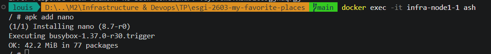
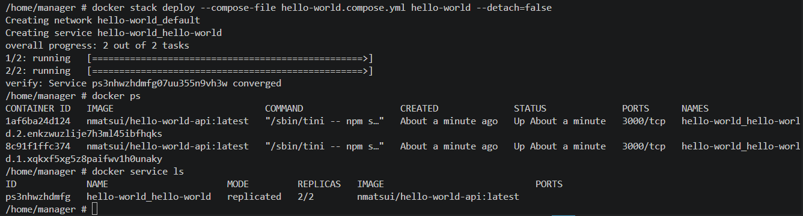
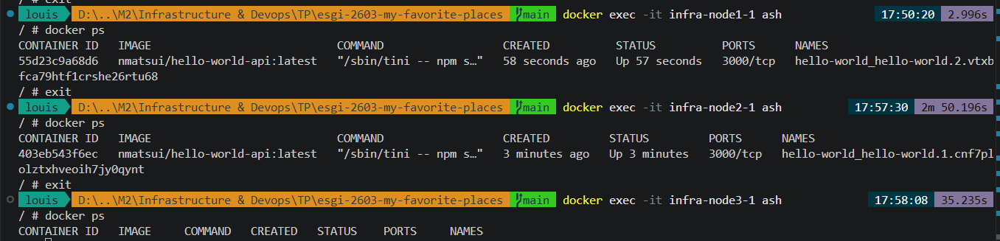

# Projet d'infrastructure et devops : Compte rendu - CAUVET Louis, M2 IW à l'ESGI Lyon


### 1) Création du cluster Docker Swarm
Pour mettre en place le cluster Docker Swarm, on crée un nouveau dossier "infra" à la racine de mon application et on y place un fichier "compose.yml" avec le code suivant :
```yaml
services:
  manager:
    image: docker:dind
    privileged: true
    hostname: manager
  node1:
    image: docker:dind
    privileged: true
    hostname: node1
  node2:
    image: docker:dind
    privileged: true
    hostname: node2
  node3:
    image: docker:dind
    privileged: true
    hostname: node3
```

Ce code permet d'instancier un container DinD appelé "Manager", et 3 autres containers workers DinD appelés "Node", avec les privilèges correspondants.

En lançant les services avec la commande `docker compose up`, ces containers se mettent en route :


On peut donc entrer dans le container "manager" avec `docker exec -it 7cb5613e4eef ash`, qui nous fait arriver dans le terminal ash de celui-ci.

Plaçons nous ensuite le bon répertoire avec `cd home`, et on constate grâce à `docker ps` que Docker est bien présent dans le container : 


On peut alors à présent initialiser un cluster Docker Swarm dans le manager, avec la commande `docker swarm init`, qui génère au passage un token afin que les autres containers puissent rejoindre le cluster :


Nous rentrons justement dans chacun des containers "node", afin de copier cette commande :


**Remarque** : au lieu d'indiquer l'adresse IP du manager dans cette commande, il aurait été judicieux de renseigner plutôt son nom de service, à savoir 'manager' puisque c'est qui a été défini dans le "compose.yml" (ligne 'hostname').

Ensuite, en retournant dans le container "manager", on s'aperçois en exécutant la commande "docker node ls" que tous les noeuds appartiennent bien au cluster :


### 2) Tests du cluster

Pour tester ce cluster, on va donc mettre en place une image 'hello-world' sur 2 noeuds à l'aide de la clause 'deploy' de Docker Swarm.

Pour cela, à la racine du dossier "infra", nous créons un nouveau fichier "hello-world.compose.yml" qui contient le code suivant : 
```yaml
services: 
  hello-world:
    image: nmatsui/hello-world-api
    deploy: 
      replicas: 2
```

Dans le container "manager", on installe nano à l'aide de la commande `apk add nano` :



Car la commande `nano hello-world.compose.yml` va permettre d'éditer un nouveau fichier "hello-world.compose.yml" qui contiendra le même code que celui défini ci-dessus.

**Remarque** : Il faut créer ce fichier dans un répertoire '/home/manager' à créer avec `mkdir`.

Une fois ce fichier écrit et enregistré, nous pouvons exécuter le déploiement de la stack sur le manager avec la commande `docker stack deploy --compose-file hello-world.compose.yml hello-world --detach=false`. 

On constate alors bien avec `docker ps` que les images 'hello-world' ont été construites sur le manager, et avec `docker service ls` que le service 'hello-world' a bien été installé sur les 2 réplicas :



De plus, si on se connecte sur chacun des containers 'node' et qu'on effectue `docker ps`, on constate que le container 'hello-world' tourne bien sur 'node1' et 'node2', avec un identifiant différent pour chacun d'entre eux.  
Par contre, 'node3' ne le possède pas, puisques seulement 2 réplicas ont été effectués :



On peut tester avec une autre clause pour le déploiement de la stack, afin de la déployer uniquement sur le manager. 
Pour cela, on change le code du 'hello-world.compose.yml' du manager pour : 
```yaml
services: 
  hello-world:
    image: nmatsui/hello-world-api
    deploy: 
      placement:
        constraints: [node.role == manager]
```
puis on relance le déploiement avec `docker stack deploy --compose-file hello-world.compose.yml hello-world --detach=false`.

Dans ce cas, on constate qu'il n'y a plus qu'un seul réplica de l'image 'hello-world', qui est situé sur le manager. En effet, si on exécute `docker ps` dans nos containeurs 'node', ce container n'est plus exécuté.

**Remarque :** A l'inverse, si on souhiate déployer la stack sur tous les noeuds, il faut que le fichier 'hello-world.compose.yml' du manager contienne : 
```yaml
services: 
  hello-world:
    image: nmatsui/hello-world-api
    deploy: 
      mode: global
```
car le mode "global" crée un container par noeud (soit 4 ici puisqu'on a un manager et 3 workers).
