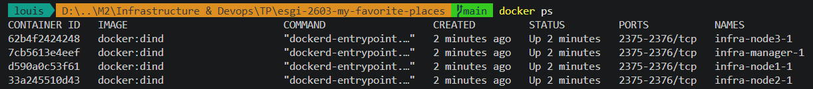
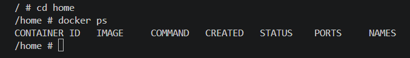
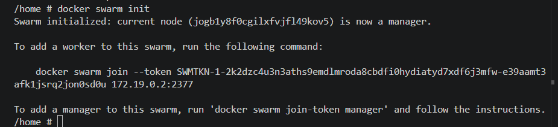
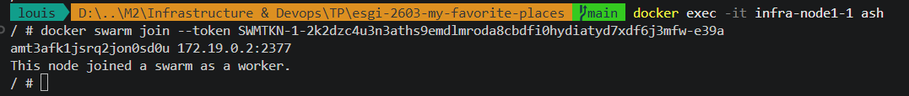
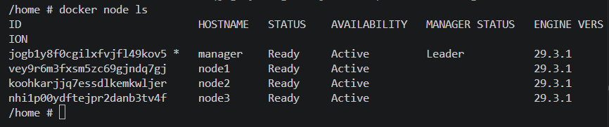

# Projet d'infrastructure et devops : Compte rendu - CAUVET Louis, M2 IW à l'ESGI Lyon


### 1) Création du cluster Docker Swarm
Pour mettre en place le cluster Docker Swarm, je crée un nouveau dossier "infra" à la racine de mon application et j'y crée un fichier "compose.yml" avec le code suivant :
```yaml
services:
  manager:
    image: docker:dind
    privileged: true
    hostname: manager
  node1:
    image: docker:dind
    privileged: true
    hostname: node1
  node2:
    image: docker:dind
    privileged: true
    hostname: node2
  node3:
    image: docker:dind
    privileged: true
    hostname: node3
```

Ce code permet d'instancier un container DinD appelé "Manager", et 3 autres containers DinD appelés "Node", avec les privilèges correspondants.

En lançant les services avec la commande `docker compose up`, ces containers se mettent en route :



Je peux donc entrer dans le container "manager" avec `docker exec -it 7cb5613e4eef ash`, qui me fait arriver dans le terminal ash de celui-ci.

Je me place ensuite le bon répertoire avec `cd home`, et constate grâce à `docker ps` que Docker est bien présent dans le container : 



Je peux alors à présent initialiser un cluster Docker Swarm dans le manager, avec la commande `docker swarm init`, qui me génère au passage un token afin que les autres containers puissent rejoindre le cluster :



Je rentre justement dans chacun des containers "node", afin de copier cette commande :



Ensuite, en retournant dans le container "manager", je m'aperçois en exécutant la commande "docker node ls" que tous les noeuds appartiennent bien au cluster :

