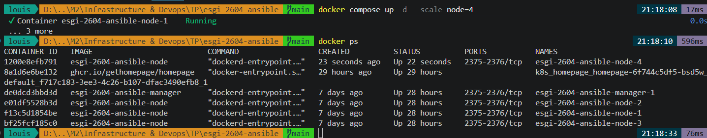
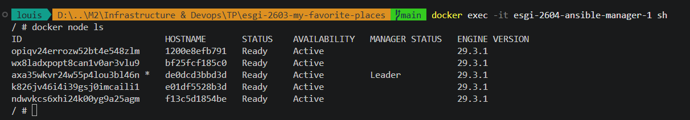
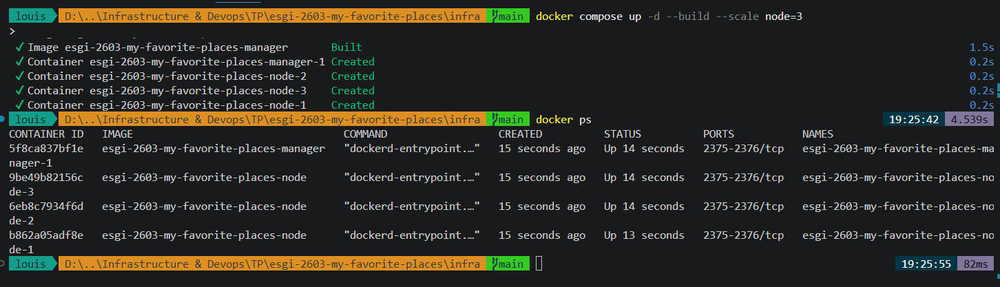
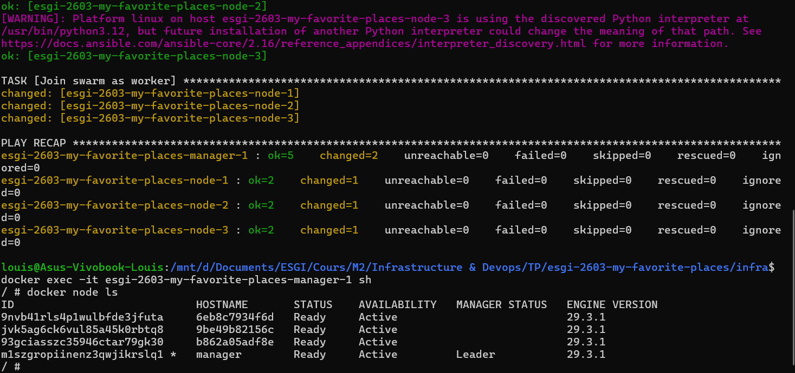

# Projet d'infrastructure et devops : Compte rendu - CAUVET Louis, M2 IW à l'ESGI Lyon


### 1) Création du cluster Docker Swarm
Pour mettre en place le cluster Docker Swarm, on crée un nouveau dossier "infra" à la racine de mon application et on y place un fichier "compose.yml" avec le code suivant :
```yaml
services:
  manager:
    image: docker:dind
    privileged: true
    hostname: manager
  node1:
    image: docker:dind
    privileged: true
    hostname: node1
  node2:
    image: docker:dind
    privileged: true
    hostname: node2
  node3:
    image: docker:dind
    privileged: true
    hostname: node3
```

Ce code permet d'instancier un container DinD appelé "Manager", et 3 autres containers workers DinD appelés "Node", avec les privilèges correspondants.

En lançant les services avec la commande `docker compose up`, ces containers se mettent en route :


On peut donc entrer dans le container "manager" avec `docker exec -it 7cb5613e4eef ash`, qui nous fait arriver dans le terminal ash de celui-ci.

Plaçons nous ensuite le bon répertoire avec `cd home`, et on constate grâce à `docker ps` que Docker est bien présent dans le container : 


On peut alors à présent initialiser un cluster Docker Swarm dans le manager, avec la commande `docker swarm init`, qui génère au passage un token afin que les autres containers puissent rejoindre le cluster :


Nous rentrons justement dans chacun des containers "node", afin de copier cette commande :


**Remarque** : au lieu d'indiquer l'adresse IP du manager dans cette commande, il aurait été judicieux de renseigner plutôt son nom de service, à savoir 'manager' puisque c'est qui a été défini dans le "compose.yml" (ligne 'hostname').

Ensuite, en retournant dans le container "manager", on s'aperçois en exécutant la commande "docker node ls" que tous les noeuds appartiennent bien au cluster :


### 2) Tests du cluster

Pour tester ce cluster, on va donc mettre en place une image 'hello-world' sur 2 noeuds à l'aide de la clause 'deploy' de Docker Swarm.

Pour cela, à la racine du dossier "infra", nous créons un nouveau fichier "hello-world.compose.yml" qui contient le code suivant : 
```yaml
services: 
  hello-world:
    image: nmatsui/hello-world-api
    deploy: 
      replicas: 2
```

Dans le container "manager", on installe nano à l'aide de la commande `apk add nano` :


Car la commande `nano hello-world.compose.yml` va permettre d'éditer un nouveau fichier "hello-world.compose.yml" qui contiendra le même code que celui défini ci-dessus.

**Remarque** : Il faut créer ce fichier dans un répertoire '/home/manager' à créer avec `mkdir`.

Une fois ce fichier écrit et enregistré, nous pouvons exécuter le déploiement de la stack sur le manager avec la commande `docker stack deploy --compose-file hello-world.compose.yml hello-world --detach=false`. 

On constate alors bien avec `docker ps` que les images 'hello-world' ont été construites sur le manager, et avec `docker service ls` que le service 'hello-world' a bien été installé sur les 2 réplicas :


De plus, si on se connecte sur chacun des containers 'node' et qu'on effectue `docker ps`, on constate que le container 'hello-world' tourne bien sur 'node1' et 'node2', avec un identifiant différent pour chacun d'entre eux.  
Par contre, 'node3' ne le possède pas, puisques seulement 2 réplicas ont été effectués :


On peut tester avec une autre clause pour le déploiement de la stack, afin de la déployer uniquement sur le manager. 
Pour cela, on change le code du 'hello-world.compose.yml' du manager pour : 
```yaml
services: 
  hello-world:
    image: nmatsui/hello-world-api
    deploy: 
      placement:
        constraints: [node.role == manager]
```
puis on relance le déploiement avec `docker stack deploy --compose-file hello-world.compose.yml hello-world --detach=false`.

Dans ce cas, on constate qu'il n'y a plus qu'un seul réplica de l'image 'hello-world', qui est situé sur le manager : 


En effet, si on exécute `docker ps` dans nos containeurs 'node', ce container n'est plus exécuté.

**Remarque :** A l'inverse, si on souhiate déployer la stack sur tous les noeuds, il faut que le fichier 'hello-world.compose.yml' du manager contienne : 
```yaml
services: 
  hello-world:
    image: nmatsui/hello-world-api
    deploy: 
      mode: global
```
car le mode "global" crée un container par noeud (soit 4 ici puisqu'on a un manager et 3 workers).

### 3) Premiers test Ansible

A partir du repo cloné, on cherche à démarrer 3 containers noeuds sans modifier le fichier 'compose.yml'.  
Pour cela, on va utiliser une option de Docker Composer : le scaling.

Une fois placé dans le répertoire du projet, on exécute `docker compose up -d --scale node=3`, afin de créer 3 containters pour le service 'node', en plus du container 'manager'.

Ainsi, si on exécute un `docker ps`, on constate que les containers en question sont bien instanciés : 


Cette approche nous permet de conserver un fichier "compose.yml" générique et de gérer dynamiquement le nombre de noeuds directement via la commande `docker compose up`.


Pour installer et tester Ansible sur une machine Windows, il faut passer par WSL (Linux sous Windows).  
Tout d'abord, installer Ubuntu avec la commande `wsl --install -d Ubuntu` dans Powershell.

Une fois Ubuntu démarré, on installe Ansible avec la commande `sudo apt install ansible -y`, ainsi que le support Docker pour Ansible avec `ansible-galaxy collection install community.docker`  
**Remarque :** On doit installer ce support car par défaut, Ansible fonctionne via SSH mais dans notre cas nous n'en avons pas, et le fichier "inventory.ini" indique que Ansible doit exécuter les commandes directement dans les containers Docker, pas via SSH avec la ligne suivante :
```ini
ansible_connection=community.docker.docker
``` 

Ainsi, si on veut pouvoir piloter des containers Docker directement, il faut inclure ce support qui ajoute à Ansible des modules Docker, et des types de connexion spécifiques.

On se place ensuite à la racine du projet pour tenter d'exécuter la commande Shell de "ansible.sh" : 
```shell
ansible-playbook -i ansible/inventory.ini ansible/init_swarm_cluster.yml
```
, et on constate alors l'erreur suivante :


qui indique que les noeuds essayent de rejoindre le hostname `router:2377`, mais que celui-çi n'existe pas dans le réseau Docker.

Pour corriger cette erreur, il faut donc modifier le fichier 'ansible/init_swarm_cluster.yaml' pour passer de 
```yaml 
command: "{{ hostvars[groups['managers'][0]]['worker_join_command'] }} router:2377"
```
à 
```yaml 
command: "{{ hostvars[groups['managers'][0]]['worker_join_command'] }} manager:2377"
```
puisque 'manager' correspond au nom du service dans le `docker compose`.

Si on relance ensuite la commande Shell 
```shell
ansible-playbook -i ansible/inventory.ini ansible/init_swarm_cluster.yml
```
, on constate que tous les nodes ont bien rejoint le cluster :


Ainsi, Le playbook est composé de deux parties :

- La première s'exécute sur le manager :
  - initialise le cluster Docker Swarm avec `docker swarm init`
  - récupère le token permettant aux noeuds de rejoindre le cluster

- La seconde s'exécute sur les workers :
  - utilise le token pour exécuter `docker swarm join`
  - connecte automatiquement chaque noeud au cluster

Ce processus permet d'automatiser entièrement la création du cluster grâce à Ansible sans intervention manuelle.  
Toutes les opérations sont exécutées en une seule commande, ce qui évite toute configuration manuelle sur chaque noeud.

En guise de vérification, on peut se connecter au manager (toujours avec `docker exec -it esgi-2604-ansible-manager-1 sh`) et exécuter `docket node ls` pour constater que tous les containers tournent bien : 


En se connectant sur les noeuds, et en exécutant `docker info | grep Swarm`, on remarque également que le cluster Swarm est bien actif : 


**Remarque :** Si l'on relance le playbook sur les mêmes machines, on observe que toutes les tâches sont à nouveau exécutées et marquées comme 'changed'.   
Cela s'explique par le fait que le playbook utilise le module `raw`, qui exécute directement les commandes sans vérifier l'état actuel du système.  
Ainsi, les commandes `docker swarm init` et `docker swarm join` sont relancées à chaque exécution, même si le cluster est déjà configuré.

### 4) Comprendre Ansible

On va essayer d'ajouter un nouveau noeud au cluster avec Docker Compse grâce à la commande `docker compose up -d --scale node=4`.

Si l'on vérifie ensuite les containeurs qui tournent avec `docker ps`, on constate bien qu'un nouveau noeud 'esgi-2604-ansible-node-4' existe : 



Cela necéssite donc d'ajouter un nouveau noeud dans la liste des workers du fichier 'inventory.ini' : 
```ini
[workers]
esgi-2604-ansible-node-1
esgi-2604-ansible-node-2
esgi-2604-ansible-node-3
esgi-2604-ansible-node-4
```
afin que Ansible le prenne en compte.

On peut ensuite relancer le playbook avec :
```shell
ansible-playbook -i ansible/inventory.ini ansible/init_swarm_cluster.yml
```
, et on constate alors que le node4 à bien rejoint le cluster.

Pour preuve, si on se connecte au manager et qu'on liste à nouveau ses containers avec `docker node ls`, on y trouve bien une mention au nouveau noeud : 



#### Adaptation pour des VMs / VPS Linux
Si l'on souhaite utiliser ce playbook sur des machines virtuelles accessibles en SSH, il faut réaliser plusieurs modifications.

Dans le fichier `inventory.ini`, il faut remplacer la connexion Docker par une connexion SSH en spécifiant l'utilisateur et la clé privée :
```ini
- ansible_connection=ssh
- ansible_user=ubuntu
- ansible_ssh_private_key_file=~/.ssh/id_rsa
```

Les noms des containers sont donc remplacés par les adresses IP des machines.

Dans le playbook `init_swarm_cluster.yml`, le module 'raw' peut être remplacé par 'command', car les machines disposent d'un environnement Python complet.
Par exemple :
```yaml
raw: "docker swarm init"
```
devient 
```yaml
command: "docker swarm init"
```

Il est également nécéssaire d'ajouter des tâches pour installer et démarrer Docker sur les machines distantes :
```yaml
- name: Install Docker
  apt:
    name: docker.io
    state: present
    update_cache: yes 
```
et 
```yaml
- name: Start Docker
  service:
    name: docker
    state: started
    enabled: yes
```

Enfin, le nom d'hôte du manager 
```yaml
{{ hostvars[groups['managers'][0]]['worker_join_command'] }} manager:2377
```
doit être remplacé par son adresse IP :
```yaml
{{ hostvars[groups['managers'][0]]['inventory_hostname'] }}:2377
```
afin de permettre aux containeurs workers de rejoindre le cluster.

Ces modifications permettent d'adapter le playbook à un environnement réel basé sur des serveurs distants.

#### Ajout de Ansible dans le projet 'favorite places'

Afin d'inclure Ansible dans le projet, on va commencer par modifier le fichier 'infra/compose.yml', car il décrit actuellement les containeurs 'manager' et 'node' de manière explicite.   
Afin de le rendre plus générique, et de créer les workers à partir de la commande `--scale`, on lui écrit donc le code suivant :
```yaml 
name: esgi-2603-my-favorite-places

services:
  manager:
    build: .
    privileged: true
    hostname: manager

  node:
    build: .
    privileged: true
```
La première ligne fixe le nom du projet Docker Compose, afin de générer la base des noms de conteneurs qui en découleront (ex : 'esgi-2603-my-favorite-places-manager-1', 'esgi-2603-my-favorite-places-node-2'...).  

Ensuite, on déclare les services Docker Compose en indiquant que les images seront construites à partir d'un fichier 'infra/Dockerfile' que l'on construira ensuite, car les images `docker:dind`ne suffiront pas dans le contexte d'Ansible puisqu'il a besoin que les machines utilisées aient Python d'installé. Ainsi, dans le 'Dockerfile', on indiquera une commande pour appliquer ce prérequis.  
Le manager conserve un nom d'hôte afin d'être facilement identifié dans le cluster Docker Swarm.

**Remarque :** Pour les noeuds, on déclare à présent un service générique qui permet d'utiliser le scaling et qui évite de définir chacun d'entre eux à la main.

Il faut donc ensuite créer un fichier 'infra/Dockerfile', dans lequel on écrit le code suivant : 
```docker
FROM docker:dind

RUN apk add --update --no-cache python3 py3-pip && ln -sf python3 /usr/bin/python
RUN apk add sudo
```

Dans ce fichier, la ligne
```docker
FROM docker:dind
```
indique qu'on part de l'image officielle `docker:dind`, comme c'était déja le cas avant. CHaque conteneur pourra donc exécuter Docker en interne.

Ensuite, la ligne
```docker
RUN apk add --update --no-cache python3 py3-pip && ln -sf python3 /usr/bin/python
```
installe python sur les machines, afin qu'Ansible puisse exécuter correctement ses modules.

Et la dernière ligne 
```docker
RUN apk add sudo
```
installe sudo, afin de pouvoir exécuter certaines commandes en usant de privilèges sur nos différentes machines.


A partir de ces 2 fichiers, si on exécute `docker compose up -d --build --scale node=3`, on obtiens bien 4 containers qui tournent : 



Chacun de ces containers est issu d'une image `docker:dind`, possède Python d'installé et peut exécuter des commandes en `sudo`.

A présent, il faut donc indiquer à Ansible lesquels sont considérés comme manager et lequels comme workers.

Pour cela, on crée un nouveau dossier 'infra/ansible' dans lequel on définit un fichier 'inventory.ini'.

On y réécrit donc le contenu de l'inventaire à l'identique de celui utilisé dans les tests d'Ansible précédemment, en adaptant bien les noms des conteneurs à ceux générés : 
```ini
[managers]
esgi-2603-my-favorite-places-manager-1

[managers:vars]
ansible_connection=community.docker.docker

[workers]
esgi-2603-my-favorite-places-node-1
esgi-2603-my-favorite-places-node-2
esgi-2603-my-favorite-places-node-3

[workers:vars]
ansible_connection=community.docker.docker
```

On a donc des conteneurs qui tournent, et un inventory Ansible qui sait les cibler.

On peut donc ensuite créer le fichier 'infra/ansible/init_swarm_cluster.yml' :
```yaml
- name: Initialize Docker Swarm
  hosts: managers
  become: yes
  tasks:
    - name: Initialize swarm on first manager
      command: docker swarm init
      run_once: true
      register: swarm_init_result
      failed_when: "'This node is already part of a swarm' not in swarm_init_result.stderr and swarm_init_result.rc != 0"

    - name: Retrieve worker join token
      command: docker swarm join-token worker -q
      register: worker_token
      run_once: true

    - name: Set worker join command as a fact
      set_fact:
        worker_join_command: "docker swarm join --token {{ worker_token.stdout }}"

    - name: Display worker join command
      debug:
        var: worker_join_command

- name: Join workers to the Swarm cluster
  hosts: workers
  become: yes
  tasks:
    - name: Join swarm as worker
      command: "{{ hostvars[groups['managers'][0]]['worker_join_command'] }} manager:2377"
      register: swarm_join_result
      failed_when: "'This node is already part of a swarm' not in swarm_join_result.stderr and swarm_join_result.rc != 0"

```
dans lequel on initialise d'abord le manager, puis Docker Swarm sur celui-ci.  
Ensuite, on récupère le token que les workers doivent utiliser pour rejoindre le cluster, puis on construit la commande qui sera utilisée sur ces workers.

Le second bloc s'exécute sur tous les workers, pour leur indiquer comment rejoindre le cluster grâce à ce token.
Au final, cela produit une commande du style `docker swarm join --token SWMTKN-1-xxxxx manager:2377`.

Pour tester, on peut alors exécuter la commande `ansible-playbook -i ansible/inventory.ini ansible/init_swarm_cluster.yml` qui démarre le playbook, puis rentrer dans le manager avec `docker exec -it esgi-2603-my-favorite-places-manager-1 sh`et lister les contenurs qui lui sont associés avec `docker node ls` :




#### Ansible et Terraform
Terraform est un outil qui sert à décrire et déployer une infrastructure, en créant et en modifiant des ressources.

Concrètement, là où Ansible sert plutôt à configurer des machines déjà disponibles, Terraform sert à : 
- créer des VM
- créer des réseaux
- créer des volumes
- créer des bases de données managées
- ...

En général, Ansible configure et orchestre donc des clusters sur le matériel mis à disposition par Terraform.
