# Projet d'infrastructure et devops : Compte rendu - CAUVET Louis, M2 IW à l'ESGI Lyon


### 1) Création du cluster Docker Swarm
Pour mettre en place le cluster Docker Swarm, on crée un nouveau dossier "infra" à la racine de mon application et on y place un fichier "compose.yml" avec le code suivant :
```yaml
services:
  manager:
    image: docker:dind
    privileged: true
    hostname: manager
  node1:
    image: docker:dind
    privileged: true
    hostname: node1
  node2:
    image: docker:dind
    privileged: true
    hostname: node2
  node3:
    image: docker:dind
    privileged: true
    hostname: node3
```

Ce code permet d'instancier un container DinD appelé "Manager", et 3 autres containers workers DinD appelés "Node", avec les privilèges correspondants.

En lançant les services avec la commande `docker compose up`, ces containers se mettent en route :

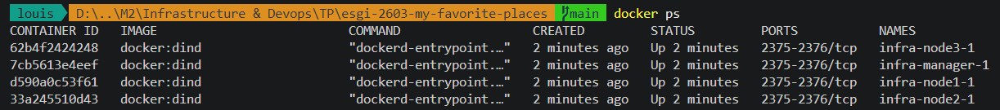

On peut donc entrer dans le container "manager" avec `docker exec -it 7cb5613e4eef ash`, qui nous fait arriver dans le terminal ash de celui-ci.

Plaçons nous ensuite le bon répertoire avec `cd home`, et on constate grâce à `docker ps` que Docker est bien présent dans le container : 

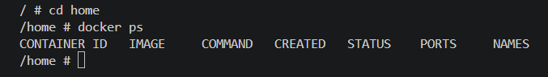

On peut alors à présent initialiser un cluster Docker Swarm dans le manager, avec la commande `docker swarm init`, qui génère au passage un token afin que les autres containers puissent rejoindre le cluster :

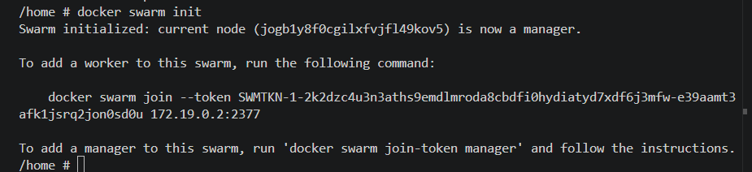

Nous rentrons justement dans chacun des containers "node", afin de copier cette commande :

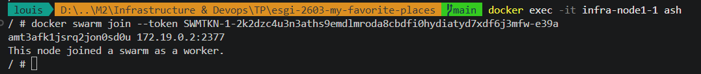

**Remarque** : au lieu d'indiquer l'adresse IP du manager dans cette commande, il aurait été judicieux de renseigner plutôt son nom de service, à savoir 'manager' puisque c'est qui a été défini dans le "compose.yml" (ligne 'hostname').

Ensuite, en retournant dans le container "manager", on s'aperçois en exécutant la commande "docker node ls" que tous les noeuds appartiennent bien au cluster :

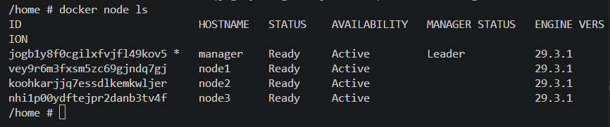

### 2) Tests du cluster

Pour tester ce cluster, on va donc mettre en place une image 'hello-world' sur 2 noeuds à l'aide de la clause 'deploy' de Docker Swarm.

Pour cela, à la racine du dossier "infra", nous créons un nouveau fichier "hello-world.compose.yml" qui contient le code suivant : 
```yaml
services: 
  hello-world:
    image: nmatsui/hello-world-api
    deploy: 
      replicas: 2
```

Dans le container "manager", on installe nano à l'aide de la commande `apk add nano` :

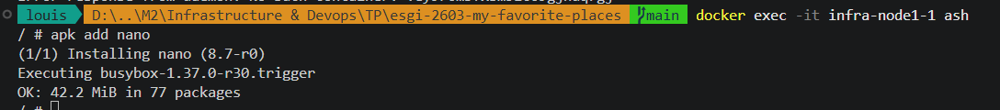

Car la commande `nano hello-world.compose.yml` va permettre d'éditer un nouveau fichier "hello-world.compose.yml" qui contiendra le même code que celui défini ci-dessus.

**Remarque** : Il faut créer ce fichier dans un répertoire '/home/manager' à créer avec `mkdir`.

Une fois ce fichier écrit et enregistré, nous pouvons exécuter le déploiement de la stack sur le manager avec la commande `docker stack deploy --compose-file hello-world.compose.yml hello-world --detach=false`. 

On constate alors bien avec `docker ps` que les images 'hello-world' ont été construites sur le manager, et avec `docker service ls` que le service 'hello-world' a bien été installé sur les 2 réplicas :

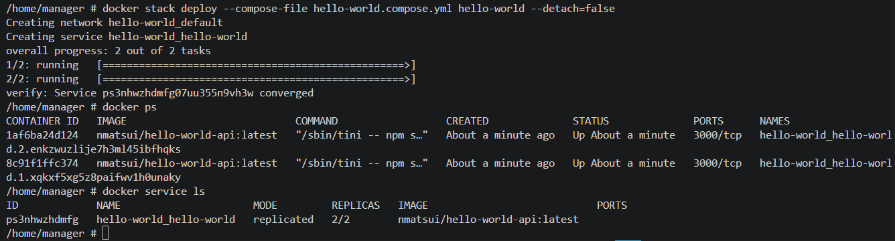

De plus, si on se connecte sur chacun des containers 'node' et qu'on effectue `docker ps`, on constate que le container 'hello-world' tourne bien sur 'node1' et 'node2', avec un identifiant différent pour chacun d'entre eux.  
Par contre, 'node3' ne le possède pas, puisques seulement 2 réplicas ont été effectués :

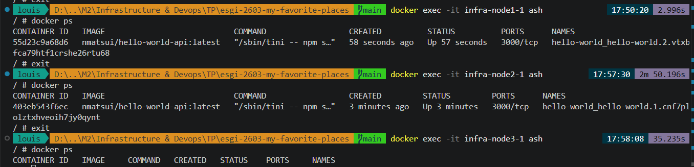

On peut tester avec une autre clause pour le déploiement de la stack, afin de la déployer uniquement sur le manager. 
Pour cela, on change le code du 'hello-world.compose.yml' du manager pour : 
```yaml
services: 
  hello-world:
    image: nmatsui/hello-world-api
    deploy: 
      placement:
        constraints: [node.role == manager]
```
puis on relance le déploiement avec `docker stack deploy --compose-file hello-world.compose.yml hello-world --detach=false`.

Dans ce cas, on constate qu'il n'y a plus qu'un seul réplica de l'image 'hello-world', qui est situé sur le manager : 

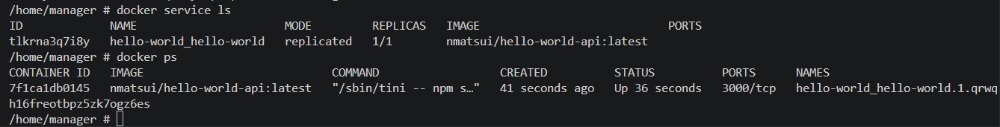

En effet, si on exécute `docker ps` dans nos containeurs 'node', ce container n'est plus exécuté.

**Remarque :** A l'inverse, si on souhiate déployer la stack sur tous les noeuds, il faut que le fichier 'hello-world.compose.yml' du manager contienne : 
```yaml
services: 
  hello-world:
    image: nmatsui/hello-world-api
    deploy: 
      mode: global
```
car le mode "global" crée un container par noeud (soit 4 ici puisqu'on a un manager et 3 workers).

### 3) Premiers test Ansible

A partir du repo cloné, on cherche à démarrer 3 containers noeuds sans modifier le fichier 'compose.yml'.  
Pour cela, on va utiliser une option de Docker Composer : le scaling.

Une fois placé dans le répertoire du projet, on exécute `docker compose up -d --scale node=3`, afin de créer 3 containters pour le service 'node', en plus du container 'manager'.

Ainsi, si on exécute un `docker ps`, on constate que les containers en question sont bien instanciés : 

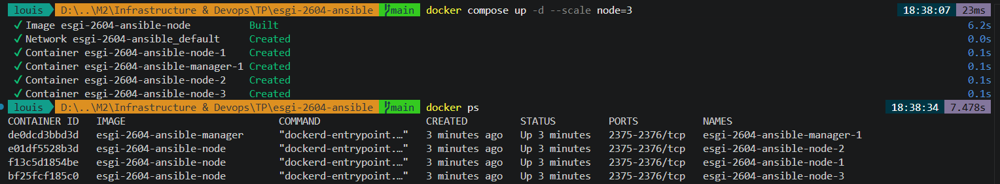

Cette approche nous permet de conserver un fichier "compose.yml" générique et de gérer dynamiquement le nombre de noeuds directement via la commande `docker compose up`.


Pour installer et tester Ansible sur une machine Windows, il faut passer par WSL (Linux sous Windows).  
Tout d'abord, installer Ubuntu avec la commande `wsl --install -d Ubuntu` dans Powershell.

Une fois Ubuntu démarré, on installe Ansible avec la commande `sudo apt install ansible -y`, ainsi que le support Docker pour Ansible avec `ansible-galaxy collection install community.docker`  
**Remarque :** On doit installer ce support car par défaut, Ansible fonctionne via SSH mais dans notre cas nous n'en avons pas, et le fichier "inventory.ini" indique que Ansible doit exécuter les commandes directement dans les containers Docker, pas via SSH avec la ligne suivante :
```ini
ansible_connection=community.docker.docker
``` 

Ainsi, si on veut pouvoir piloter des containers Docker directement, il faut inclure ce support qui ajoute à Ansible des modules Docker, et des types de connexion spécifiques.

On se place ensuite à la racine du projet pour tenter d'exécuter la commande Shell de "ansible.sh" : 
```shell
ansible-playbook -i ansible/inventory.ini ansible/init_swarm_cluster.yml
```
, et on constate alors l'erreur suivante :

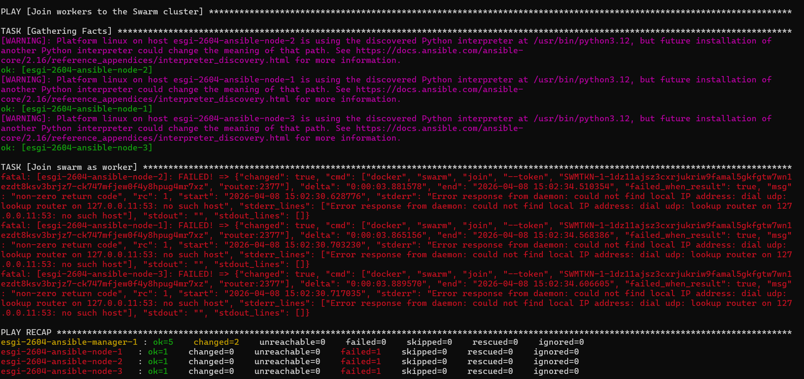

qui indique que les noeuds essayent de rejoindre le hostname `router:2377`, mais que celui-çi n'existe pas dans le réseau Docker.

Pour corriger cette erreur, il faut donc modifier le fichier 'ansible/init_swarm_cluster.yaml' pour passer de 
```yaml 
command: "{{ hostvars[groups['managers'][0]]['worker_join_command'] }} router:2377"
```
à 
```yaml 
command: "{{ hostvars[groups['managers'][0]]['worker_join_command'] }} manager:2377"
```
puisque 'manager' correspond au nom du service dans le `docker compose`.

Si on relance ensuite la commande Shell 
```shell
ansible-playbook -i ansible/inventory.ini ansible/init_swarm_cluster.yml
```
, on constate que tous les nodes ont bien rejoint le cluster :

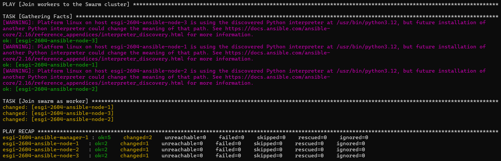

Ainsi, Le playbook est composé de deux parties :

- La première s'exécute sur le manager :
  - initialise le cluster Docker Swarm avec `docker swarm init`
  - récupère le token permettant aux noeuds de rejoindre le cluster

- La seconde s'exécute sur les workers :
  - utilise le token pour exécuter `docker swarm join`
  - connecte automatiquement chaque noeud au cluster

Ce processus permet d'automatiser entièrement la création du cluster grâce à Ansible sans intervention manuelle.  
Toutes les opérations sont exécutées en une seule commande, ce qui évite toute configuration manuelle sur chaque noeud.

En guise de vérification, on peut se connecter au manager (toujours avec `docker exec -it esgi-2604-ansible-manager-1 sh`) et exécuter `docket node ls` pour constater que tous les containers tournent bien : 

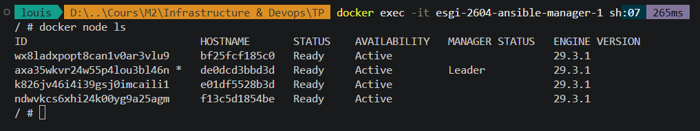

En se connectant sur les noeuds, et en exécutant `docker info | grep Swarm`, on remarque également que le cluster Swarm est bien actif : 

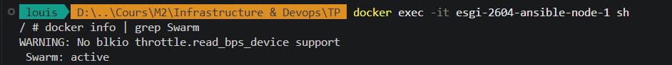

**Remarque :** Si l'on relance le playbook sur les mêmes machines, on observe que toutes les tâches sont à nouveau exécutées et marquées comme 'changed'.   
Cela s'explique par le fait que le playbook utilise le module `raw`, qui exécute directement les commandes sans vérifier l'état actuel du système.  
Ainsi, les commandes `docker swarm init` et `docker swarm join` sont relancées à chaque exécution, même si le cluster est déjà configuré.

### 4) Comprendre Ansible